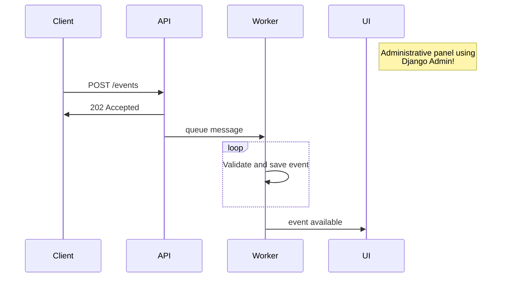

# Question

A answer to this [challenge](challeng). Originally posted [here](https://gist.github.com/wsantos/fdc18cec2329777f74f1ba00098c9d0b).

# The Eye

A RESTful API to collect event data from trusted applications of the Consumer Affairs.



## About Constraints & Requirements

### Performance

The solution is entire dockerized running on my own machine.

I was not reach the ~100 requests per second running (production mode) in a MacBook Pro with 8GB RAM, 2.3 GHz Intel Core i5, SSD, 256GB SSD, OS X 12.2.1.

With around ~40 requests per second a bit degradation are perceptive and with around ~50 requests per second the volume of errors turns on unneceptable.

I choosed to not use the DRF ViewSet and Serializer to keep throughput the higher as possible.

When the API receive a request, a message is enqued and a HTTP 202 is returned to the client.

The all proccess to save and validate event is delegated to the Worker.

Worker is a Celery application using Rabbit MQ as broker.

### About observability

I configured logs to use `console`, but considering that The Eye is a real application I believe that use a specialized platform such as New Relic, Datadog, Elastic Stack or even Graphana and/or Prometheus on premise is a more robust way out.

I log messages when a request is received and save/validated

### About Validators

I used factories to create instances of the validators, at this point I believe this options is easier to understand and extend, but if the number of validator grow up, maybe thinking in other alternatives can be necessary.


## How to run?

Copy .env sample with appropriate values and runs the following steps

- docker compose build web
- make migrate
- make createsuperuser
- make generatetoken email={email}
- make runserver
- make runworker (in another tab ou shell)

_Open API_ must be available on [http://localhost:8000/api/schema/swagger-ui](http://localhost:8000/api/schema/swagger-ui) and can be consumed for any REST clients like Postman or Insomnia or directly using Python or cURL.

For example:

```bash
curl --location --request POST 'http://localhost:8000/events/' \
    --header 'Authorization: Bearer <token>' \
    --header 'Content-Type: application/json' \
    --data-raw '{
        "session_id": "e2085be5-9137-4e4e-80b5-f1ffddc25423",
        "category": "page interaction",
        "name": "cta click",
        "data": {
            "host": "www.consumeraffairs.com",
            "path": "/",
            "element": "chat bubble"
        },
        "timestamp": "2023-01-01 09:15:27.243860Z"
    }'
```

or

```python
import requests
import json

url = "http://localhost:8000/events/"

payload = json.dumps({
  "session_id": "e2085be5-9137-4e4e-80b5-f1ffddc25423",
  "category": "page interaction",
  "name": "cta click",
  "data": {
    "host": "www.consumeraffairs.com",
    "path": "/",
    "element": "chat bubble"
  },
  "timestamp": "2023-01-01 09:15:27.243860Z"
})
headers = {
  'Authorization': 'Bearer <token>',
  'Content-Type': 'application/json'
}

response = requests.request("POST", url, headers=headers, data=payload)
```

To access the collected events is possible to use [Django Admi](http://localhost:8000/admin/).

## How to run load test?

Prepare the infra using steps above (build, migrate, createsuperuser, generatetoken) and run the following steps:

Change the [locust file](tests/locustfile) and set the var `token` with the token generated in the previous step.

And run `make loadtest` to start Locust. The Locust UI can be accessed at [http://localhost:8089/](http://localhost:8089/)
